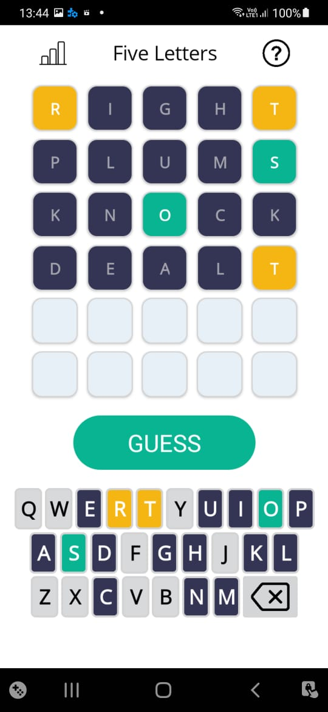
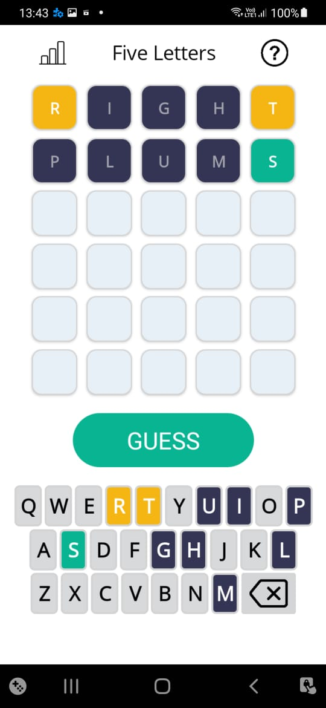
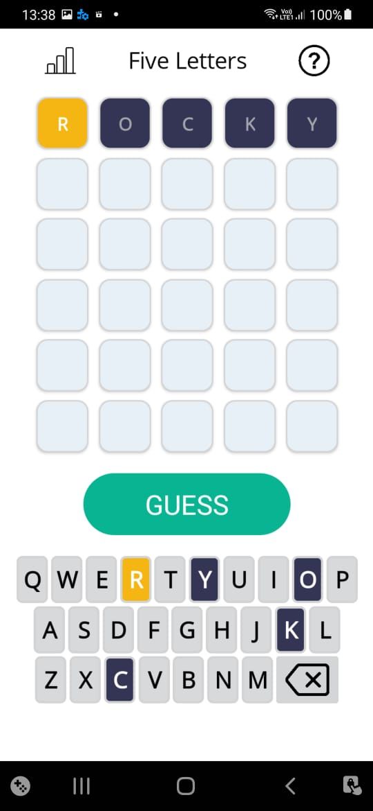
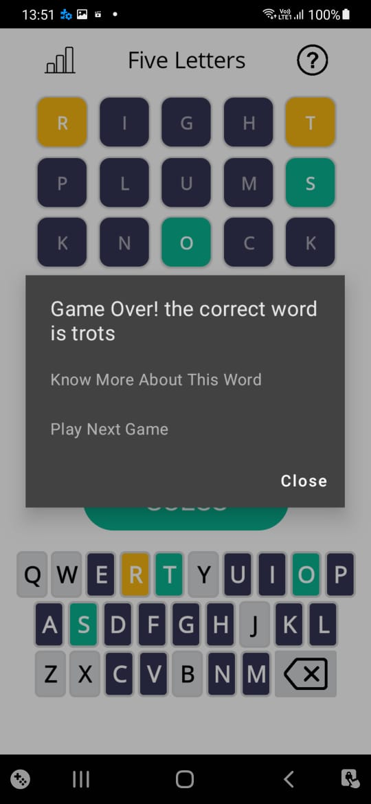
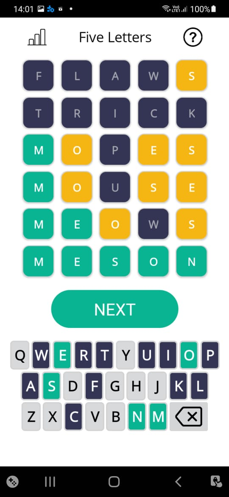
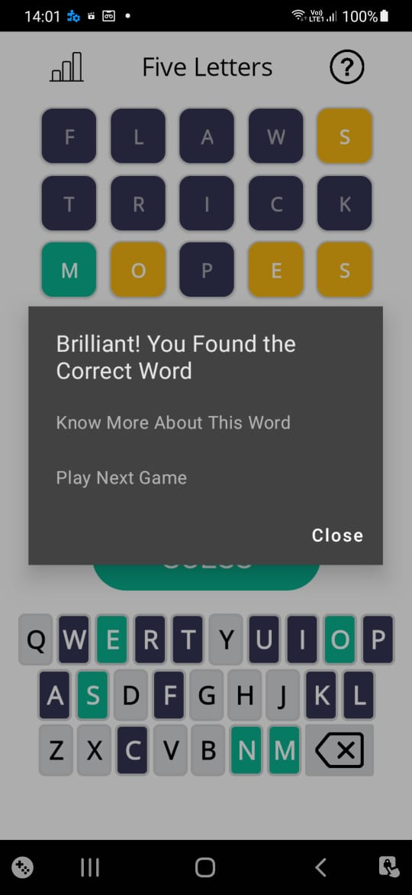

# Five Letters

## Overview
The **Five Letters** project is a cross-platform word puzzle game that challenges users to guess a hidden five-letter word within a limited number of attempts. Inspired by popular games like Wordle, the app aims to deliver an engaging and educational gaming experience that fosters cognitive development and vocabulary expansion.

Built using **.NET MAUI**, this project demonstrates the potential of modern cross-platform app development tools, providing a consistent and polished user experience across multiple operating systems.

## Download
- [Project Report](https://github.com/aman-gill-97/FiveLetters/raw/main/report/Project-Report-322101415.pdf)
- [APK File](https://github.com/aman-gill-97/FiveLetters/raw/main/apk/com.amangill.fiveletters.apk)

## Aim of the Project
The primary goal of the **Five Letters** project is to create an intuitive, fun, and intellectually stimulating mobile game that combines entertainment with educational value. By offering players an opportunity to enhance their language and problem-solving skills, the app promotes strategic thinking and cognitive development.

## How to play Fiveletters

<div style="display: flex; align-items: center;"> <div style="flex: 1;"> <h3>Instructions:</h3> <ol> <li>You have 6 tries to guess the WORD.</li> <li>Enter a valid 5-letter word and press the "Guess" button to check your guess.</li> <li>The color of the tiles will change to show how close you are to guessing the correct word: <ul> <li><strong>Green</strong>: The letter is in the correct position.</li> <li><strong>Yellow</strong>: The letter is in the word but in the wrong position.</li> <li><strong>Gray</strong>: The letter is not in the word.</li> </ul> </li> </ol> </div> <div style="flex: 1; text-align: center;">        </div> </div>

## Technology Used

The **Five Letters** project utilizes the following technologies:

- **.NET MAUI**: A cross-platform framework for building mobile apps, ensuring compatibility across both iOS and Android platforms.
- **C#**: The primary programming language used for application logic.
- **XAML**: Used for designing the user interface, providing a clean and maintainable separation of UI and business logic.
- **Git & GitHub**: Version control and repository hosting for collaborative development.
- **Visual Studio**: The integrated development environment (IDE) used for building and debugging the application.


## Key Features
- **Cross-Platform**: Developed using .NET MAUI for seamless functionality across iOS and Android.
- **Word Guessing Gameplay**: Users guess a five-letter word within a set number of attempts.
- **Interactive Feedback**: Real-time feedback after each attempt guides users toward the correct answer.
- **User Engagement**: Challenging yet accessible gameplay encourages frequent interaction and competition for high scores.
- **Educational Focus**: Promotes vocabulary growth and cognitive skills in an entertaining way.

## Educational Benefits
The game has a strong educational component, focusing on improving:
- **Vocabulary**: Exposure to new words during gameplay helps users expand their vocabulary.
- **Cognitive Skills**: Problem-solving, pattern recognition, and strategic thinking are key to mastering the game.

## Technological Innovation
By leveraging **.NET MAUI**, the project showcases modern cross-platform mobile app development, allowing for streamlined deployment and reduced development time while maintaining a consistent user experience across different devices.

## Project Scope
1. **Design and Development**: Create a functional prototype using .NET MAUI.
2. **Core Features**: Implement word selection, interactive feedback, and an intuitive user interface.
3. **Usability Testing**: Evaluate performance, user experience, and educational impact.
4. **Continuous Improvement**: Refine the app based on user feedback and testing results.

## Future Enhancements
While the current version focuses on delivering a minimum viable product (MVP), future updates may include:
- Additional word sets and difficulty levels.
- Multiplayer features for competing with friends.
- Advanced analytics for tracking learning progress.

## Publication on Linkedin
- Title: Revolutionizing Word Games: A .NET MAUI Five Letters Project
- Author: Amaninder Singh Gill
- Platform: LinkedIn
- URL: [Revolutionizing Word Games: A .NET MAUI Five Letters Project](https://www.linkedin.com/pulse/revolutionizing-word-games-net-maui-five-letters-project-singh-rrk7c?trackingId=kSUH6jCdTnCPiyh2xoQwLg%3D%3D&lipi=urn%3Ali%3Apage%3Ad_flagship3_detail_base%3BxiPpg2epRya%2FxUORvCzX6w%3D%3D)
- Status: Published


## Repository Structure
```
.
├── .gitignore               # Specifies intentionally untracked files to ignore when using Git
├── Worzle.sln               # The Visual Studio Solution file that contains the projects
├── FiveLetters              # The main project folder
│   ├── Worzle.csproj        # The C# project file
│   ├── Program.cs           # The main entry point for the application
│   ├── Properties           # Contains the AssemblyInfo file and other properties
│   ├── Resources            # Contains resources used by the application like images, icons, etc.
│   ├── ...                  # Other project related files and folders
├── README.md                # The file you're reading now, provides an overview of the project
├── LICENSE                  # The license file, specifies the license for the project
```

## Get Started
To get started with the **Five Letters** project:
1. Clone this repository.
   ```bash
   git clone https://github.com/aman-gill-97/five-letters.git
   ```
2. Build the project using **.NET MAUI**.
   ```bash
   dotnet build
   ```
3. Deploy and run on your desired platform (iOS or Android).


## Contributions
Contributions are welcome! If you have suggestions or bug reports, feel free to open an issue or submit a pull request.

